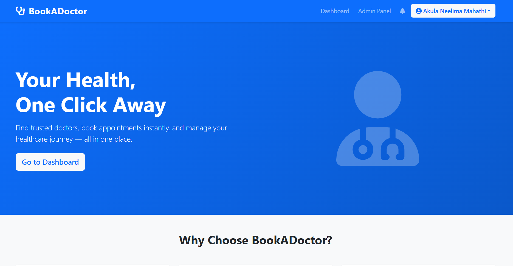
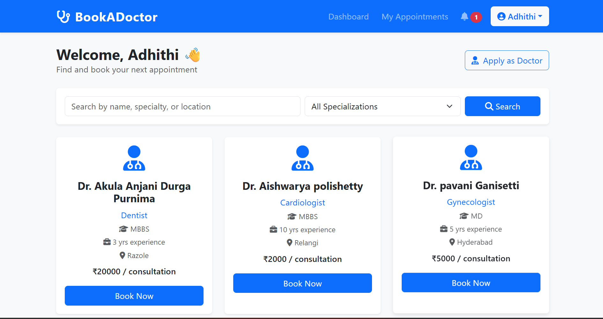
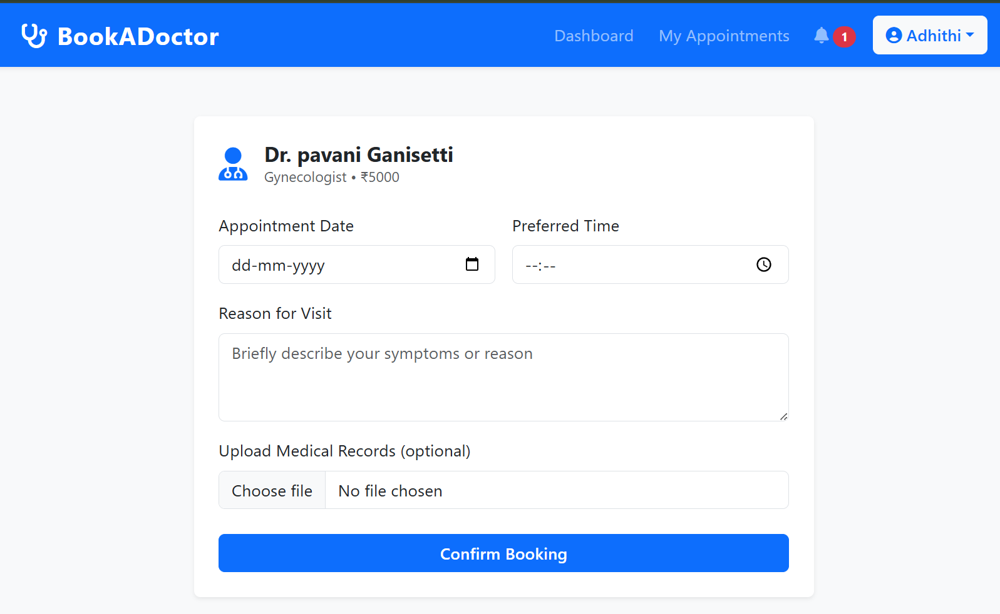
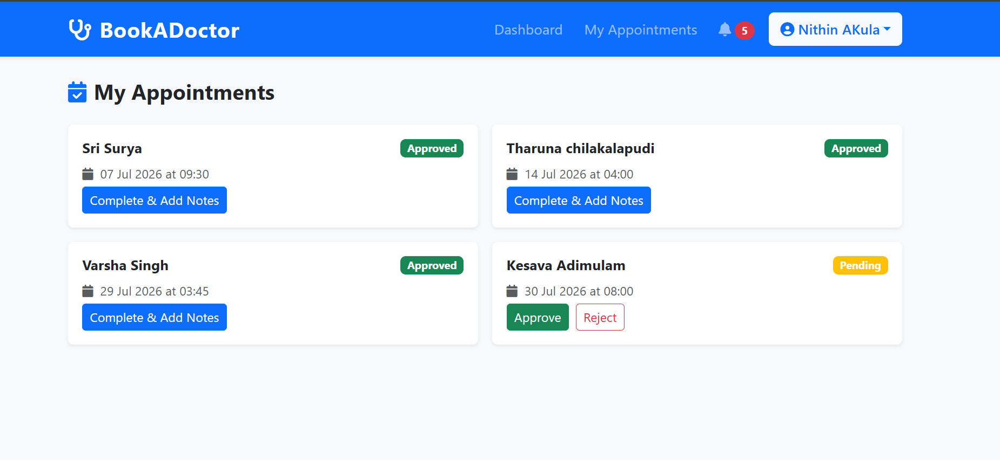
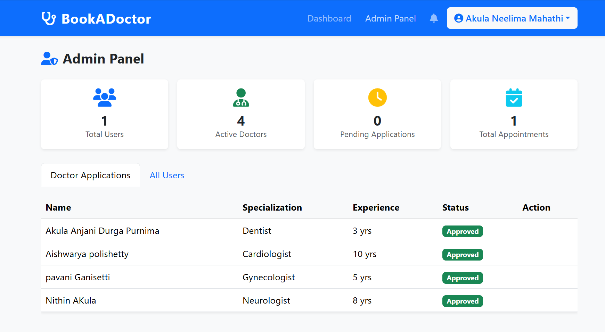

# Book a Doctor — MERN Stack App

A full healthcare appointment booking platform built with **MongoDB, Express.js, React, and Node.js**, following the **MVC architecture** described in the project requirements.

## Features

- **Patient**: register/login, browse & filter doctors (specialty/location/search), book appointments with document upload, view appointment history, cancel appointments, apply to become a doctor.
- **Doctor**: dashboard to view/approve/reject appointment requests, add visit summaries/prescriptions/follow-up notes, mark appointments complete.
- **Admin**: approve/reject doctor applications, view all users, dashboard stats (total users, doctors, pending applications, appointments).
- **Auth**: JWT-based sessions, bcrypt password hashing, role-based access control (RBAC) for patient/doctor/admin.
- **Notifications**: in-app notifications for appointment status changes and doctor approvals.

## 📸 Screenshots

Below are some screenshots of the application showcasing the main
modules.

### Landing Page



------------------------------------------------------------------------

### Patient Dashboard



------------------------------------------------------------------------

### Book Appointment



------------------------------------------------------------------------

### Doctor Dashboard



------------------------------------------------------------------------

### Admin Panel




## Tech Stack

| Layer | Tech |
|---|---|
| Frontend | React, Bootstrap 5, Material UI icons, Axios, React Router, Moment.js |
| Backend | Express.js, Mongoose (MVC pattern) |
| Database | MongoDB |
| Auth | JWT + bcrypt |
| File uploads | Multer |

## Project Structure

```
book-a-doctor/
├── backend/
│   ├── models/         # Mongoose schemas: User, Doctor, Appointment, Notification
│   ├── controllers/     # Business logic
│   ├── routes/          # Express routes (View layer of MVC)
│   ├── middleware/       # JWT auth, role-based guards
│   ├── uploads/          # Uploaded medical documents
│   └── server.js
└── frontend/
    └── src/
        ├── components/   # Navbar, DoctorCard, ProtectedRoute
        ├── pages/        # Landing, Login, Register, Dashboard, Appointments, AdminPanel...
        ├── context/      # AuthContext (JWT + user state)
        └── utils/api.js  # Axios API layer
```

## Setup Instructions

### 1. Prerequisites
- Node.js (v16+)
- MongoDB running locally, or a MongoDB Atlas connection string

### 2. Backend Setup

```bash
cd backend
npm install
JWT_SECRET=mysecretkey123
npm run dev
```
Backend runs on `http://localhost:5000`.

### 3. Frontend Setup

```bash
cd frontend
npm install
npm start
```
Frontend runs on `http://localhost:3000` (proxies API calls to the backend).

### 4. First-time usage
1. Register an account — choose **Admin** role for one account to manage the platform, and **User** for patients.
2. As a User, you can apply to become a Doctor from the Dashboard.
3. Log in as Admin → approve the doctor application.
4. The approved doctor account can now log in and manage appointments.
5. Patients can search/filter doctors and book appointments.

## API Overview

| Method | Endpoint | Description |
|---|---|---|
| POST | `/api/auth/register` | Register user/admin |
| POST | `/api/auth/login` | Login |
| GET | `/api/doctors` | List approved doctors (filter/search) |
| POST | `/api/doctors/apply` | Apply as doctor |
| POST | `/api/appointments/book` | Book appointment (with file upload) |
| GET | `/api/appointments/patient` | Patient's appointments |
| GET | `/api/appointments/doctor` | Doctor's appointments |
| PUT | `/api/appointments/:id/status` | Approve/reject/complete appointment |
| GET | `/api/admin/doctors` | All doctor applications |
| PUT | `/api/admin/doctors/:id/status` | Approve/reject doctor |
| GET | `/api/admin/stats` | Dashboard stats |
| GET | `/api/notifications` | User's notifications |

## Notes
- This implements the full user flow from your requirements doc: registration → browsing → booking → confirmation → management → admin approval → doctor's appointment management → consultation → post-appointment follow-up.
- MVC pattern is reflected directly in the backend folder structure (models / controllers / routes).
